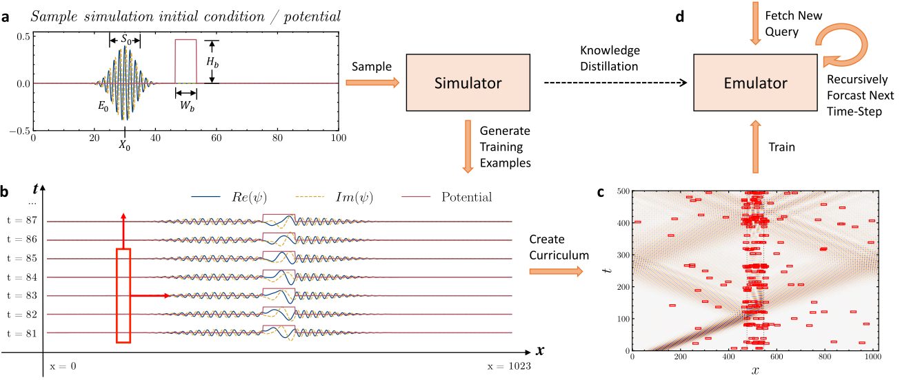

# Emulating Quantum Dynamics with Neural Networks via Knowledge Distillation

This repository contains the source code for the paper
Yu Yao, Chao Cao, Stephan Haas, and Marcin Abram, 
_Emulating Quantum Dynamics with Neural Networks via Knowledge Distillation_ (2021).

The purpose of this code is to illustrate our framework and to replicate the main results of our paper.

## Introduction

We introduce a novel framework for training machine learning-based emulators.
It combines ideas of knowledge distillation and curriculum learning.
The main goal is to construct a process in which the emulator can extract
the basic rules governing the time evolution of a physical system.

The main framework is illustrated below.




First, we simulate the physical system of our interest.
Then, we construct individual training examples, and we build a training curriculum.
The goal is to represent all the interesting phenomena that we wish to capture.
For example, to describe the propagation of quantum packets, we must capture dispersion,
scattering, tunneling, and quantum wave-interference.
In the next step, we use our curriculum of simple examples to train our emulator.
To test the generalization capability of our machine learning model,
we measure whether the emulator can predict the evolution of more complex systems.

## Installation

These instructions are for machines with the Linux Operating System.
Installation on Windows or macOS should be similar, just make sure
that the gcc compiler for C is installed in the system.

**Clone this Repository**

```shell
git clone https://github.com/yaoyu-33/quantum_dynamics_machine_learning
cd quantum_dynamics_machine_learning
```

**Create Virtual Environment and Install dependencies**
```shell
python -m virtualenv qwave
source qwave/bin/activate
pip install -r requirements.txt
```

**Install ffmpeg for rendering simulations**
```shell
sudo apt update
sudo apt install ffmpeg
```

## Demonstration

To see a demonstration of our framework, check the Jupyter notebook in the _demonstration_ folder.

**Data Preparation**

Run the notebook [part1_data_preparation.ipynb](demonstration/part1_data_preparation.ipynb) to generate the training data. The training examples will be saved to a specified folder on your disk.

***Model Training***

Run the notebook [part2_model_training.ipynb](demonstration/part2_model_training.ipynb) to train the emulators.

***Forecasting***

Run the notebook [part3_forecasting.ipynb](demonstration/part3_forecasting.ipynb) to forcast the time-evolution of the quantum system. This notebook also includes a series of tests to compare various model architectures.

## Results


## Discussion

The main difference from the typical supervised learning setting is that the distributions
of training and test examples are essentially different.
The goal is to construct an informative curriculum of simple examples.
Next, to extract the main rules describing the time-evolution of a physical system.
Finally, to combine the acquired knowledge and use it to forecast the time-evolution of more complex systems,
that could be hard to emulate in a standard way.

Our framework can be relevant to researchers working in the fields of quantum chemistry, material science, and quantum optics.
It can be used to model quantum devices and to simulate quantum information propagation.

If you wish to learn more about our project, check our article.

## Citation

TBA

