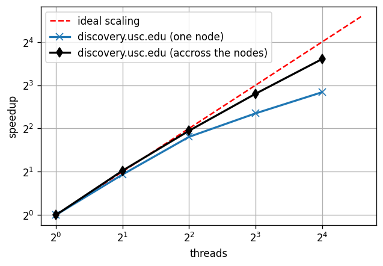

# Emulator Benchmarks

## Training Data

To get the data, install `gdown`

    pip install gdown

Download the training and test data

    cd ~/
    gdown https://drive.google.com/uc?id=1r1S48SC0NslVOdj89mzVrzcx7082u7Lh

Your md5sum should be

    432f2ee3b3e978efab24e51b6f527dcf  micro_datasets.zip

Unzip the data

    unzip micro_datasets.zip

If you use CUDA, specify the correct path for the XLA, e.g.,

    export XLA_FLAGS=--xla_gpu_cuda_data_dir=/usr/lib/cuda/

## Single Training

First, install all dependencies specify in the [requirements.txt](../../requirements.txt)

    pip install -r ../../requirements.txt

To train the neural network-based emulator, run

    time PYTHONPATH=./ python train.py --datasets_path=~/micro_datasets/datasets/

You can change parameters of the training
by editing the `global_config.py` file.

## Slurm Job Description

The slurm job description is in the `train.job` file.

To submit a slurm job, run

    sbatch train.job
    
You can check if your job is in the queue by running

    squeue -u $USER

## Scalability Benchmark

Tu run a scalability benchmark we use the [ray library](https://docs.ray.io/en/master/index.html).
First, install ray,

    pip install ray

Then, run

    time PYTHONPATH=./ python scalability_benchmark.py -c 4 --datasets_path=~/micro_datasets/datasets/

Where we specified to use 4 CPUs (see `python scalability_benchmark.py -h` to see all the options).

## Results

We tested the scalability on the USC Discovery cluster.
We performed two experiments, one across the nodes (with the fixed number of cores per node),
and second for one node (changing the number of available processors).

The scalability across the nodes is close to ideal. The measured network
traffic between two nodes was about 200 kB/s (for the central node the
measured network traffic was 200*N kB/s where N is the number of nodes).

The line showing the scalability for one node (blue) deviates from the ideal
scaling more than the line for scalability across the nodes (black line).
This might be an effect of the Intel Turbo Boost Technology being present. 
When running our program on one node and scaling the number of available
logical cores, the effective frequency of the involved cores depend on the
total load of the processor. When only few logical cores are involved,
their frequency is larger than the frequency of cores under more balanced load.
This might explain the deviation of the blue line from the ideal scaling. 
However, when measuring the scaling across the nodes, the frequency of each
individual core is the same regardless how many cores are involved. Thus,
we should observe smaller  deviation from the line of ideal scaling.

## Unit Tests

Install

    pip install pytest

Next, run

    PYTHONPATH=./ py.test tests/

To check the coverage, install

    pip install coverage

Then, run

    coverage run --source='.' -m unittest discover tests "*_test.py"
    coverage report -m --omit=,"tests/*","global_config.py","train.py","scalability_benchmark.py","*/__init__.py"
