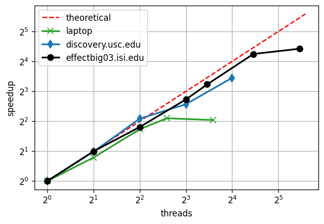

# Simulator Benchmark

## Preparation

Compile the code

    gcc -O -o simulator.x ../../simulator/quantum_wave_packets/simulator.c -lm

Make sure that you have write access to a temp folder. By default we use the `/tmp` location.

## Benchmark

Run

    time python scalability_benchmark.py -p 4 -n 12 --verbose 1

Where the "-p" argument indicates how many processes we create, and the "-n" argument indicates how many groups of examples we create.

You can change the parameters of the simulation in the `config.py` file.

## Results

We tested the scalability on various machines:
    - Local PC with 6 physical and 12 logical cores (green).
    - The Center for Advanced Research Computing's Discovery computing cluster with various nodes up to 16 cores (blue). 
    - The ISI's computing cluster with 24 physical and 48 logical cores (black).

The deviation from the theoretical (ideal) line can be easily understood. In case of the ISI's computing cluster,
we have 48 logical cores but just 24 physical cores.
The hyperthreading doesn't really help in cpu-heavy operations.
Under 24 threads, that we have nearly-ideal scaling.
This indicates that the writing/reading operations (at least in the measured regime)
are not creating any particular bottleneck.

## Unit Tests

Install

    pip install pytest

Next, run

    PYTHONPATH=./ py.test tests/

To check the coverage, install

    pip install coverage

Then, run

    coverage run --source='.' -m unittest discover tests "*_test.py"
    coverage report -m --omit=,"tests/*","config.py","*/__init__.py"
